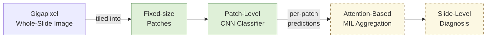
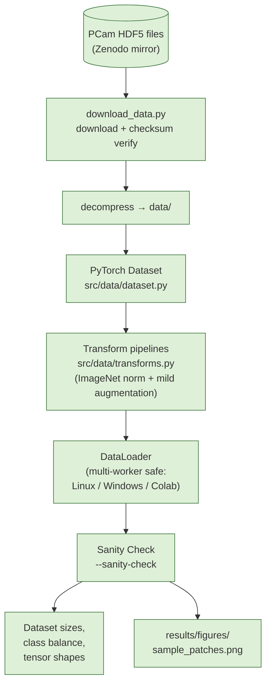

<div align="center">

# 🔬 PathologyAI-Explorer

**Preliminary Exploration of Histopathology Patch Classification and Attention-Based Multiple Instance Learning**

[](#-project-progress)
[](LICENSE)
[](https://www.python.org/)
[](https://pytorch.org/)
[](https://github.com/basveeling/pcam)

*A scoped, honest research exploration into computational pathology — built to learn, not to overclaim.*

</div>

---

## 📌 Overview

**PathologyAI-Explorer** documents an undergraduate-level exploration of **computational pathology**, focused on:

- **Patch-level histopathology classification** using the [PatchCamelyon (PCam)](https://github.com/basveeling/pcam) dataset (metastatic breast cancer detection in lymph node sections)
- The conceptual bridge between patch-level predictions and **whole-slide image (WSI)** analysis via **Multiple Instance Learning (MIL)**
- A transparent record of what has actually been built vs. what is planned — no fabricated results, no premature claims

> ⚠️ This is **not** a production or clinical-grade system, and it does not (yet) implement full WSI classification. It is a scoped research exercise demonstrating the ability to learn and reason rigorously about a new medical-imaging subdomain.

---

## 🧭 Where This Fits: Patch Classification vs. Whole-Slide Diagnosis

Whole-slide images are gigapixel-scale — far too large to feed directly into a CNN. The standard workaround is to classify small patches individually, then aggregate patch-level evidence into a single slide-level decision using MIL. This project currently implements the **patch classification pipeline** (left + middle of the diagram below); the **MIL aggregation stage** (right) is a documented, scoped exploration planned for a later phase.



**Legend:** 🟢 Green = implemented in this repo (patch pipeline) · 🟡 Yellow (dashed) = planned, scoped exploration (MIL / CLAM)

---

## ⚙️ Data Pipeline Architecture (Implemented — Phase 1)



Every box above corresponds to code that runs today — no placeholders, no stubs.

---

## 🧩 Key Concepts

| Concept | Description |
|---|---|
| **Histopathology** | Microscopic tissue examination for disease diagnosis — here, metastatic breast cancer in lymph node sections. |
| **Whole-Slide Imaging (WSI)** | Gigapixel-scale digitized tissue slides, too large for direct CNN input. |
| **Patch Classification** | Small, fixed-size crops classified individually — exactly what PCam provides pre-extracted. |
| **Multiple Instance Learning (MIL)** | Standard method for aggregating many patch-level predictions into one slide-level label without per-patch ground truth. |
| **Attention-Based Aggregation** | Learned weighting (as in CLAM) so the most diagnostically relevant patches drive the slide-level decision. |

---

## 📊 Project Progress

**Current status: Data pipeline implemented — model training pending.**



```mermaid
gantt
    dateFormat  X
    axisFormat %s
    section Phase 1: Data Pipeline
    Download + checksum verification      :done, p1a, 0, 1
    PyTorch Dataset/DataLoader             :done, p1b, 0, 1
    Transform pipelines                    :done, p1c, 0, 1
    Sanity check + sample-patch grid       :done, p1d, 0, 1
    section Phase 2: Training & Evaluation
    ResNet50 transfer learning             :active, p2a, 1, 2
    Evaluation metrics (Acc/P/R/F1/CM)     :p2b, 1, 2
    Training curves + failure analysis     :p2c, 1, 2
    section Phase 3: WSI / MIL
    WSI-MIL conceptual docs + diagram      :p3a, 2, 3
    Scoped CLAM exploration                :p3b, 2, 3
```

| Component | Status |
|---|:---:|
| PCam download, checksum, decompression | ✅ Done |
| Dataset / DataLoader pipeline | ✅ Done |
| Train/eval transforms | ✅ Done |
| Data-pipeline sanity check + visualization | ✅ Done |
| ResNet50 transfer-learning training | ⏳ Planned |
| Evaluation metrics & confusion matrix | ⏳ Planned |
| Training/validation curves | ⏳ Planned |
| WSI/MIL conceptual documentation | ⏳ Planned |
| Scoped CLAM exploration | ⏳ Planned |

---

## 📈 Results

No experiments have been run yet. **No accuracy, F1, or other performance numbers exist in this repository**, and none will be added until they come from an actual executed training run.

---

## 🔍 CLAM Exploration

Not started. Will be added as a clearly separate, explicitly scoped exploration once the core PCam classification pipeline (Phase 1) is complete — see the approved project scope in `docs/` (to be added).

---

## ⚠️ Limitations

- PCam provides pre-extracted 96×96 patches, not full WSIs — this project does not perform WSI-scale processing.
- Patch-level classification does not by itself constitute slide-level diagnosis; the relationship between the two is a documentation exercise (Phase 3), not an additional experiment.
- No stain normalization is applied in Phase 1 beyond the augmentation pipeline's mild color jitter; PCam's own patch-selection process already filters for tissue content (see `data/README.md`).

Full limitations will be documented in `docs/limitations.md` once experiments exist.

---

## 🚀 Setup

```bash
pip install -r requirements.txt
```

### Download the dataset

```bash
python scripts/download_data.py
```

Downloads PCam's HDF5 files from the official Zenodo mirror (~8 GB total), verifies checksums, and decompresses them into `data/`. See `data/README.md` for source details, manual fallback links, and split/leakage documentation.

### Run the data pipeline sanity check

```bash
python -m src.data.dataset --sanity-check
```

This does **not** train anything. It loads all three splits, reports dataset sizes and class balance, checks tensor shapes end-to-end through a real `DataLoader`, and saves a sample-patch grid to `results/figures/sample_patches.png`.

---

## 📁 Repository Structure

```
PathologyAI-Explorer/
├── configs/            # Experiment / pipeline configuration files
├── data/                # Downloaded + decompressed PCam data (gitignored)
├── notebooks/          # Exploratory notebooks
├── results/
│   └── figures/         # Saved sanity-check visualizations
├── scripts/
│   └── download_data.py # PCam download + checksum + decompression
├── src/
│   └── data/
│       ├── dataset.py    # PyTorch Dataset/DataLoader
│       └── transforms.py # Train/eval transform pipelines
├── requirements.txt
└── LICENSE
```

---

## 📚 Citation

If referencing the dataset used here:

> B. S. Veeling, J. Linmans, J. Winkens, T. Cohen, M. Welling. "Rotation Equivariant CNNs for Digital Pathology." arXiv:1806.03962 (2018).

PCam is derived from the CAMELYON16 challenge dataset.

---

## 📄 License

Code in this repository is MIT licensed (see `LICENSE`). The PCam dataset itself is separately CC0-licensed by its original authors — see `data/README.md`.
