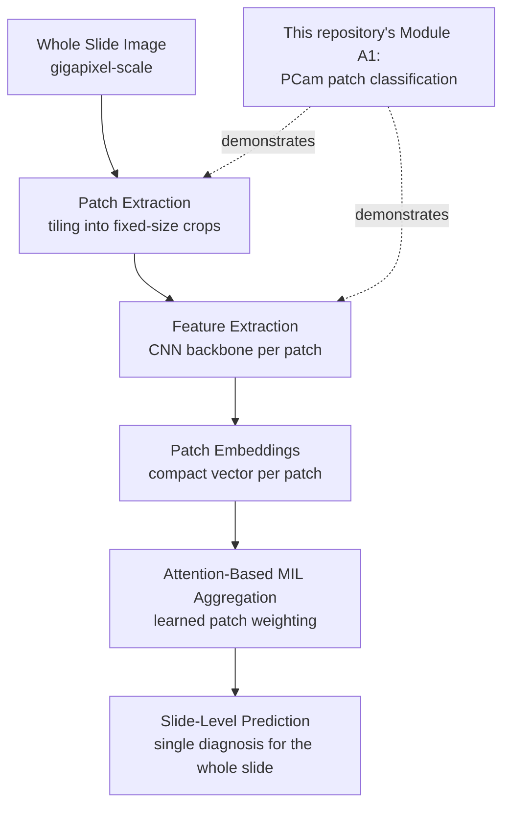

# From Patch Classification to Whole-Slide Diagnosis: A Conceptual Bridge

This document explains how the patch-level classification pipeline in this
repository (`src/`) relates to full whole-slide image (WSI) analysis in
computational pathology. **This is a documentation exercise, not an
additional experiment** — no slide-level model is trained or evaluated
here. Its purpose is to make explicit what the PCam patch classifier does
and does not demonstrate, and why the field structures WSI analysis the way
it does.

## Why Whole-Slide Images Can't Be Fed Directly Into a CNN

A digitized histopathology slide (a WSI) is typically **gigapixel-scale** —
commonly 50,000 to 100,000+ pixels on each side, often 1–5 GB per file even
compressed. A standard CNN like ResNet50 expects fixed, modestly-sized
inputs (e.g. 224×224 or 96×96). Three problems follow directly from this
scale mismatch:

1. **Memory**: a single WSI at full resolution cannot fit in GPU memory
   alongside a deep CNN's activations.
2. **Label granularity**: WSIs are usually labeled at the *slide* level
   (e.g. "contains metastasis" / "does not"), not per-pixel or per-region —
   pathologists don't exhaustively annotate every cell.
3. **Signal sparsity**: diagnostic evidence (e.g. a small tumor deposit)
   may occupy a tiny fraction of an otherwise-normal slide, so most of the
   image carries no direct diagnostic signal.

This is why the standard pipeline in computational pathology is **patch
extraction**: the slide is tiled into many small, fixed-size crops (patches)
that a CNN can process individually.

## Where PCam Fits

The PatchCamelyon (PCam) dataset used in this repository (`src/data/`,
Module A1) is a **pre-extracted patch dataset** derived from the CAMELYON16
WSI collection. Each 96×96 patch is independently labeled for the presence
of metastatic tissue in its central region. Training a classifier on PCam
(as this repository does) demonstrates **patch-level classification** — a
necessary building block of WSI analysis, but not the whole pipeline.

**What this repository's ResNet50/PCam experiment shows:** a model can
learn to distinguish tumor-containing from tumor-free tissue at the patch
level, with real measured accuracy/precision/recall/F1.

**What it does not show:** how to combine many such patch-level predictions
across an entire slide into a single, reliable slide-level diagnosis. That
step requires a different formulation, described next.

## From Patches to a Slide-Level Prediction: Multiple Instance Learning

Once a WSI is tiled into (often thousands of) patches, the question becomes:
*given predictions or features for all these patches, what is the
prediction for the slide as a whole?* This is naturally framed as
**Multiple Instance Learning (MIL)**.

In MIL terminology:
- A **bag** = one whole-slide image.
- An **instance** = one patch extracted from that slide.
- The bag is labeled (e.g. "malignant" / "benign"), but individual
  instances (patches) are *not* — exactly the situation with most
  real-world WSI datasets, where exhaustive patch-level annotation is
  infeasible.
- The standard MIL assumption: a bag is positive if **at least one**
  instance in it is positive (e.g. one tumor-containing patch is enough to
  call the whole slide positive) — this maps naturally onto how
  pathologists actually work, scanning a slide for *any* diagnostic region
  rather than requiring uniform positivity.

A simple (but weak) MIL approach would be: classify every patch
independently (as Module A1 does), then take the maximum patch-level score
as the slide-level score. This ignores useful information — some patches
are far more diagnostically informative than others, and a simple max
operation is sensitive to noise from a single misclassified patch.

## Attention-Based Aggregation

Modern WSI-MIL methods (e.g. CLAM, explored architecturally in
`docs/clam_exploration.md`) instead **learn** how to weight each patch's
contribution to the slide-level prediction, rather than using a fixed rule
like max-pooling. This is done with an **attention mechanism**:

1. Each patch is passed through a feature extractor (e.g. a CNN, possibly
   the same kind of backbone used in Module A1) to produce a patch
   **embedding** — a compact vector representation rather than a raw
   classification score.
2. A learned attention network assigns each patch embedding a weight,
   reflecting how relevant that patch is to the slide-level decision.
3. Patch embeddings are combined into a single **slide-level
   representation** via this attention-weighted sum (not a simple average
   or max).
4. A final classifier maps the slide-level representation to a
   prediction.

The advantage over Module A1's per-patch classification: the model learns
*which* patches matter most for the slide-level call, and can down-weight
irrelevant or ambiguous regions — closer to how a pathologist scans a slide
and focuses on the most suspicious areas, rather than voting equally across
the entire tissue area.

## The Full Pipeline

**Reading this diagram against this repository's actual scope:** Module A1
(the ResNet50/PCam experiment) demonstrates the patch extraction →
feature/classification step in isolation, using PCam's pre-extracted
patches as a stand-in for the "Patch Extraction" stage of a real WSI
pipeline. The attention-based aggregation and slide-level prediction stages
(the right half of the diagram) are **not implemented** in this repository
— they are explored at the architectural level only, in the scoped CLAM
exploration (`docs/clam_exploration.md`), where computational and dataset
constraints are documented explicitly.

## Summary

| Stage | Implemented in this repo? | Where |
|---|---|---|
| Patch-level classification | Yes — real trained model, real metrics | Module A1 (`src/`) |
| Feature extraction for MIL | Conceptually equivalent to A1's backbone, not repurposed into a MIL pipeline | This document |
| Attention-based aggregation | No — architecture explained only | `docs/clam_exploration.md` |
| Slide-level prediction | No | Future work |

This scoping is intentional: it lets the patch-classification claim be
fully backed by an executed experiment, while being explicit about what
would be required to extend this work to genuine slide-level diagnosis.
